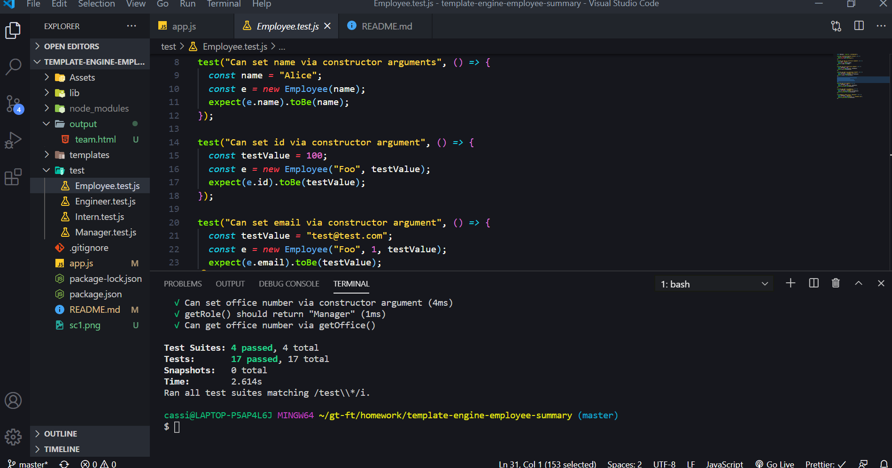
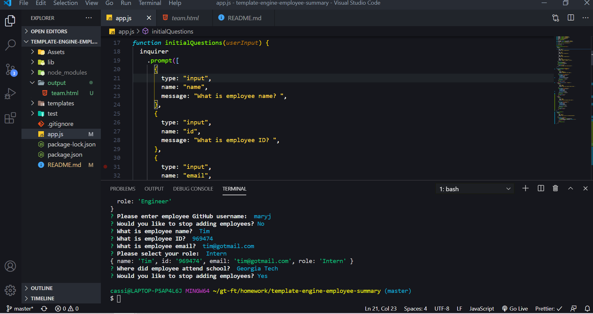
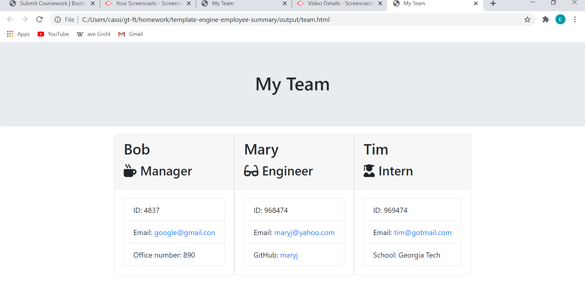

# Template Engine - Employee Summary

## Description

With this application, the user is able to dynamically create a list of their current work staff, along with the ability to add new employees. When they run the application, they are prompted with an initial set of questions that apply to every employee. Once those questions are answered, the user is asked what role that employee has within the company. There are 3 choices: manager, engineer, and intern. Based on the answer, each role has a specific question pertaining to their position. After an employee has been added to the database, the user is prompted if they would like to stop adding employees. This happens after every employee. The application then dynamically creates an html file titled, "team.html", and when opened in the browser, shows all employee information neatly formatted and organized.  

## Installation

The application is found within the repo proveded and can be easily cloned. Next, open file in VS Code, and run `node app.js` within the terminal. This will prompt the questions that the user has to answer, and when completed, a html file will be created containing the all of the information provided. This file will be inside a folder titled, "output".
  
The screenshot below shows the test being ran and passing. We ran the test before any code was written to assure that we didn't receive a false positive.
  

   
This screenshot shows the prompts that appear when the application is ran. The user will answer predetermined questions about their employees, which will be saved and used to dynamically create a html file.
  

   
The html file will be inside the output folder, and can be opened and viewed in the browser. The user will find they insormation they entered organized and formatted for them to view.
  

  

## Questions

For any questions, contact me on any of the following links:

Email: edibozu@gmail.com

GitHub Repo: https://github.com/Edibozu/template-engine-employee-summary

LinkedIn: https://www.linkedin.com/in/eduardo-pineda-5595431b6/

## Contributions

This application was aided by my fellow classmates during our after class study sessions. 

## License

MIT License

Copyright (c) [2020] [Eduardo Pineda]

Permission is hereby granted, free of charge, to any person obtaining a copy
of this software and associated documentation files (the "Software"), to deal
in the Software without restriction, including without limitation the rights
to use, copy, modify, merge, publish, distribute, sublicense, and/or sell
copies of the Software, and to permit persons to whom the Software is
furnished to do so, subject to the following conditions:

The above copyright notice and this permission notice shall be included in all
copies or substantial portions of the Software.

THE SOFTWARE IS PROVIDED "AS IS", WITHOUT WARRANTY OF ANY KIND, EXPRESS OR
IMPLIED, INCLUDING BUT NOT LIMITED TO THE WARRANTIES OF MERCHANTABILITY,
FITNESS FOR A PARTICULAR PURPOSE AND NONINFRINGEMENT. IN NO EVENT SHALL THE
AUTHORS OR COPYRIGHT HOLDERS BE LIABLE FOR ANY CLAIM, DAMAGES OR OTHER
LIABILITY, WHETHER IN AN ACTION OF CONTRACT, TORT OR OTHERWISE, ARISING FROM,
OUT OF OR IN CONNECTION WITH THE SOFTWARE OR THE USE OR OTHER DEALINGS IN THE
SOFTWARE.
